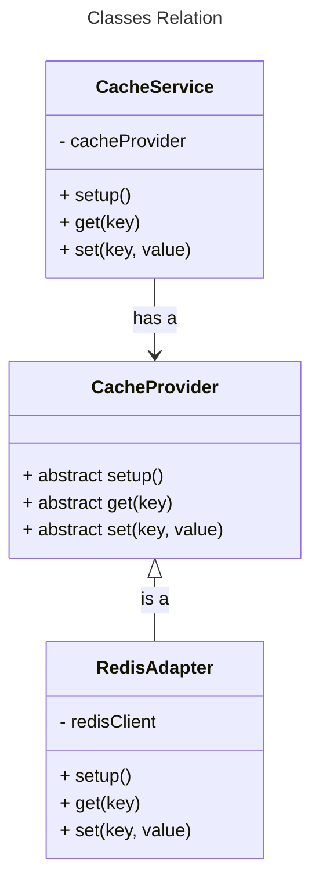

## Code Report

### Requirements
1. Create a Spring Boot/JS application with a simple service (e.g., fetching user details).
2. Implement caching using caching abstraction.
3. Configure a cache provider (e.g., EhCache, Redis).
4. Demonstrate the caching functionality by showing the difference in response times for cached vs. non-cached requests

### Approach
This task requires an implementation of a caching service storing result data from fetching api. To build a comprehensive caching service with best practices, I exploit different design patterns in the project with 3 main classes:

- [CacheProvider](/src/CacheProvider.ts)
- [RedisAdapter](/src/RedisAdapter.ts)
- [CacheService](/src/CacheService.ts)

The `CacheProvider` is a base class representing any cache provider that could be used in this project. For example, `RedisAdapter` is a sub class inheriting `CacheProvider` and compositing a `redis` instance. Other cache providers can extend the abstract class as an adapter to work with the cache service.

The `CacheService` is a caching service class managing all caches in the application. It takes a `CacheProvider` in the constructor to set and get data under the hood. To maintain the consistency of the data access and ensure efficient resource ultilzation, only a single instance of `CacheService` is used in the application, which is the global const `CacheClient` exported [here](src/CacheService.ts). In contrast, `CacheService` is private and cannot be imported in other files.



### Design Patterns

#### Adapter Pattern
Adapter pattern is used in this project to allow multiple caching providers to work with our cache service without the need to change any existing code. Since `CacheService` takes in any `CacheProvider`, other providers like `redis` can have their own adapter classes, extending `CacheProvider`, implementing the abstract functions, and work with cache service smoothly even if they have a complete different interface. For example, if a cache provider have `setKey()` and `getKey()` instead of `set()` and `get()`, the adapter still allows them to work with caching service without updating the existing code in the caching service. 

#### Inheritance & Composition
`CacheProvider` is an abstract class, not a concrete one so that the implementations are not tightened to one single cache provider. The specific cache provider will inherit this class and has concrete implementations.

On the other hand, `CacheService` composites a private `CacheProvider` and exposes its methods (set, get, setup, etc.) through public functions. With this composition, detailed implementation of the caching provider is hidden and the caching provider cannot be accessed from outside, protecting it from undesired cache manupilations.

These techniques allow `CacheService` to integrate seamlessly with a variety of caching providers such as `RedisAdapter`, `EhCacheAdapter`, etc.


#### Singleton and Private
Finally, in most case, a caching client should be a singleton to ensure the data access is consistent and the resource usage is optimized. Multiple connections from the application to a cache server could lead to unnecessary resource consumption and potential breakdowns. Additionally, a single instance ensures all parts of the application interact with the same cache instance, preventing duplicates and redundancy. 

Therefore, only one single instance of `CacheService` is created and exported to be widely used in the project. 


### Result

Fetching data is roughly 2 times faster with caching in the application. Below is an example from running index.ts
```
Fetch without cache: 1.114s
Fetch with cache: 0.527ms
```

### Running on local

To run this application locally, clone this repo and run:

```
npm install
tsc && node dist/index
```


