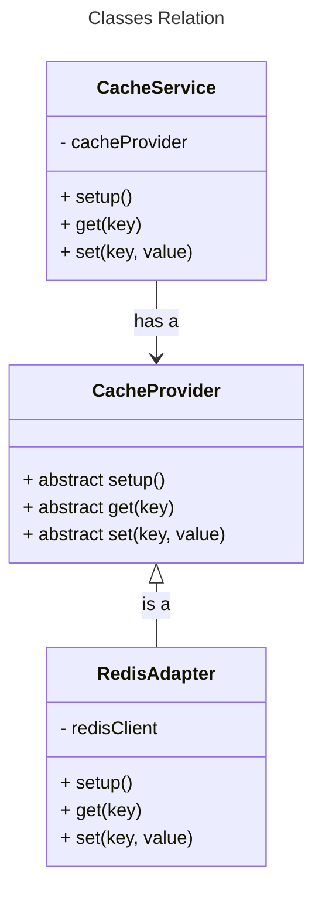

## Báo cáo bài tập

### Đề bài
1. Create a Spring Boot/JS application with a simple service (e.g., fetching user details).
2. Implement caching using caching abstraction.
3. Configure a cache provider (e.g., EhCache, Redis).
4. Demonstrate the caching functionality by showing the difference in response times for cached vs. non-cached requests

### Cách tiếp cận
Nhiệm vụ này yêu cầu triển khai một cache service lưu trữ kết quả dữ liệu từ việc lấy API. Để xây dựng một cache service toàn diện với các phương pháp tốt nhất, em sử dụng các OOP design patterns khác nhau với 3 lớp chính:

- [CacheProvider](/src/CacheProvider.ts)
- [RedisAdapter](/src/RedisAdapter.ts)
- [CacheService](/src/CacheService.ts)

`CacheProvider` là một lớp trừu tượng đại diện cho bất kỳ `CacheProvider` nào có thể được sử dụng. Ví dụ, `RedisAdapter` là một lớp con kế thừa `CacheProvider` và sử dụng 1 `redis client`. Các `CacheProvider` khác có thể kế thừa lớp trừu tượng này như một bộ thích hợp để làm việc với `CacheService`.

`CacheService` là một lớp quản lý tất cả các cache được lưu trữ trong ứng dụng. Nó nhận một `CacheProvider` trong hàm khởi tạo để lưu trữ và lấy dữ liệu dưới lớp. Để duy trì tính nhất quán trong việc truy cập dữ liệu và đảm bảo việc sử dụng tài nguyên hiệu quả, chỉ có một thực thể duy nhất của `CacheService` được sử dụng, đó là hằng global `CacheClient` được export ở cùng file. Ngược lại, `CacheService` là lớp private và không thể import trong các file khác.



### Design Patterns

#### Adapter Pattern

Adapter Pattern được sử dụng trong dự án này để cho phép nhiều `CacheProvider` làm việc với `CacheService` mà không cần thay đổi mã hiện tại. Vì `CacheService` có thể nhận 1 cache provider bất kỳ, các provider khác như redis có thể có các lớp adapter của chúng, kế thừa `CacheProvider`, triển khai các hàm trừu tượng và làm việc với `CacheService` một cách mượt mà ngay cả khi chúng có interface hoàn toàn khác biệt. Ví dụ, nếu một provider có các hàm `setKey()` và `getKey()` thay vì `set()` và `get()`, bộ điều hợp adapter vẫn cho phép chúng làm việc với `CacheService` mà không cần cập nhật code hiện tại trong `CacheService`.

#### Inheritance & Composition

Vì `CacheProvider` là một lớp trừu tượng, không phải lớp cụ thể, nên việc triển khai các hàm không bị ràng buộc với một provider duy nhất. Một provider cụ thể sẽ kế thừa lớp này và có các triển khai hàm cụ thể.

Mặt khác, `CacheService` sở hữu một thực thể private `CacheProvider` và công khai các phương thức của nó (set, get, setup, v.v.) thông qua các hàm công khai. Với sự kết hợp này, triển khai chi tiết của provider bị ẩn và chúng không thể truy cập được từ bên ngoài, bảo vệ chúng khỏi việc thao tác cache không mong muốn.

Những kỹ thuật này cho phép `CacheService` tích hợp mượt mà với nhiều `CacheProvider` khác nhau như `RedisAdapter`, `EhCacheAdapter`, v.v.

#### Singleton and Private
Cuối cùng, trong hầu hết các trường hợp, chỉ nên có duy nhất một cache cient để đảm bảo việc truy cập dữ liệu nhất quán và sử dụng tài nguyên hiệu quả. Việc kết nối nhiều lần từ ứng dụng đến cache server có thể dẫn đến việc sử dụng tài nguyên không cần thiết và có thể gây ra sự cố như rate limit. Thêm vào đó, một thực thể (instance) duy nhất đảm bảo tất cả các phần của ứng dụng tương tác với cùng một thực thể bộ nhớ đệm, ngăn ngừa trùng lặp và sự dư thừa.

Do đó, chỉ có một thực thể duy nhất của `CacheService` được tạo ra và export để được sử dụng rộng rãi trong ứng dụng.

### Kết quả

Việc lấy dữ liệu nhanh gấp khoảng 2 lần khi sử dụng bộ nhớ đệm trong ứng dụng. Dưới đây là một ví dụ từ việc chạy file `index.ts`:

```
Fetch without cache: 1.114s
Fetch with cache: 0.527ms
```

### Chạy trên máy tính cá nhân
Để chạy ứng dụng này trên máy tính cá nhân, bạn cần:

1. Cài đặt Redis trên máy của bạn
2. Chạy một máy chủ Redis với cổng mặc định (6379) trong một terminal
3. Clone repo này và chạy:

```
npm install
tsc && node dist/index
```


